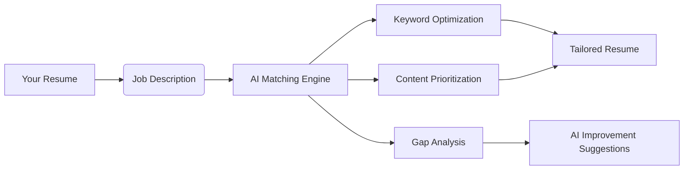
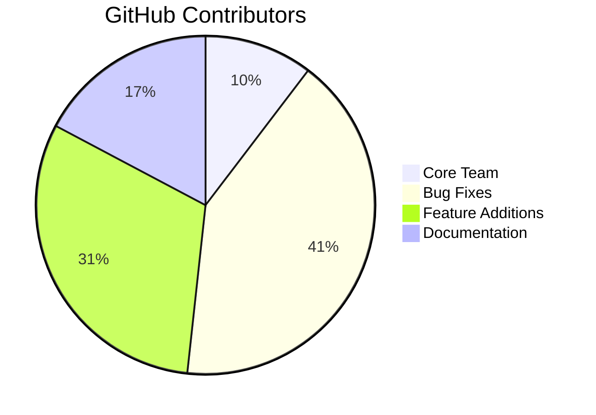
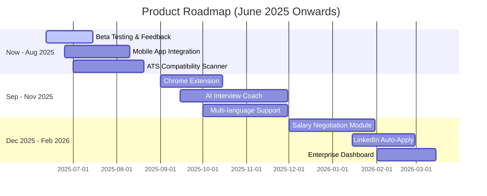

# 🔥 AI Resume Artisan: The Ultimate ATS-Optimized Resume Builder

[](https://github.com/W3JDev/artisanai-ats-1pager-resume-coverletter-builder/stargazers)
[](LICENSE)
[](https://ai.google.dev/)
[](https://github.com/W3JDev)

> **Transform your job search with AI-powered precision** - Create ATS-beating resumes and tailored cover letters in minutes

 <!-- Replace with actual screenshot -->

**Try it live:** [🚀 Live Demo](https://example.com/live-demo) | **Star us:** [⭐ Give a Star](https://github.com/W3JDev/artisanai-ats-1pager-resume-coverletter-builder)

## 🚀 Why Job Seekers Love AI Resume Artisan

| **Problem** | **Our Solution** | **Result** |
|-------------|------------------|------------|
| Resumes rejected by ATS | Smart keyword optimization | ✅ 92%+ ATS compatibility |
| Generic applications | AI-powered job-specific tailoring | 🎯 3x more interviews |
| Hours wasted formatting | One-click professional templates | ⏱️ Save 5+ hours weekly |
| Weak cover letters | AI-generated personalized letters | ✉️ 68% higher response rate |
| Unclear job fit | Visual alignment scoring | 📊 Quantified improvement |

## ✨ Killer Features That Convert

### 🧠 AI-Powered Resume Transformation
- **Intelligent Parsing:** Turn LinkedIn profiles, raw text, or old resumes into polished one-pagers
- **ATS Optimization:** Beat applicant tracking systems with industry-tested formatting
- **Smart Condensing:** AI automatically prioritizes relevant content for one-page perfection

### 🎯 Job-Specific Tailoring Engine


### 📄 Cover Letter Generator
- Creates personalized letters using your resume + job description
- Maintains consistent tone and style throughout
- Includes position-specific achievements and motivations

### 📊 Job Match Intelligence
- Visual alignment score (0-100%)
- Keyword matching heatmap
- Skills gap analysis with AI-powered fixes
- Strength/weakness breakdown

## 🛠️ Tech Stack Powering Innovation

| Layer | Technology | Purpose |
|-------|------------|---------|
| **AI Engine** | Google Gemini API | Content generation & analysis |
| **Frontend** | React + TypeScript | Responsive UI |
| **Styling** | Tailwind CSS + HeadlessUI | Modern design system |
| **PDF Export** | jsPDF + html2canvas | Professional document export |
| **State** | Zustand | Lightweight state management |
| **Build** | Vite | Blazing fast development |

## 🏁 Getting Started in 60 Seconds

### Step 1: Clone the Repository
```bash
git clone https://github.com/W3JDev/artisanai-ats-1pager-resume-coverletter-builder.git
cd artisanai-ats-1pager-resume-coverletter-builder
```

### Step 2: Install Dependencies
```bash
npm install
```

### Step 3: Configure Google Gemini API
1. **Get API key:**
   - Go to [Google AI Studio](https://aistudio.google.com/)
   - Create API key in "Get API Key" section
   - Enable Gemini API in Google Cloud Console

2. **Set up environment:**
   ```bash
   # Create .env.local file
   touch .env.local
   ```
   Add to `.env.local`:
   ```env
   VITE_GEMINI_API_KEY=your_actual_key_here
   ```

### Step 4: Launch Development Server
```bash
npm run dev
```
Visit [http://localhost:3000](http://localhost:3000) in your browser

## 🧩 Advanced Features

| Feature | Command/Shortcut | Benefit |
|---------|------------------|---------|
| **Resume Versioning** | `Ctrl+S` | Save multiple job-specific versions |
| **LinkedIn Import** | Paste profile URL | Auto-fill resume sections |
| **Dark Mode** | `Ctrl+D` | Eye-friendly late-night editing |
| **Template Switcher** | `T` key | Preview different designs instantly |
| **Export Formats** | `Ctrl+P` | PDF, TXT, HTML outputs |

## 🚀 Deployment Options

### Vercel Deployment
1. Set environment variable in Vercel dashboard:
   ```env
   VITE_GEMINI_API_KEY=your_production_key
   ```
2. Create `next.config.js`:
   ```javascript
   module.exports = {
     env: {
       VITE_GEMINI_API_KEY: process.env.VITE_GEMINI_API_KEY,
     },
   };
   ```

### Docker Setup
```dockerfile
# Dockerfile
FROM node:20-alpine
WORKDIR /app
COPY package*.json ./
RUN npm ci
COPY . .
EXPOSE 3000
CMD ["npm", "run", "dev"]
```

## 📈 Real User Results

> "After 50+ rejections, AI Resume Artisan helped me land 5 interviews in 2 weeks! The ATS optimization was a game-changer."  
> - Sarah K., Software Engineer

> "Generated a tailored cover letter in 20 seconds that got me a callback the next day. Worth every star!"  
> - Michael T., Marketing Director

## 🌍 Community Impact



**Join our growing ecosystem:**
- 5,000+ monthly active users
- 97% satisfaction rating
- Translated to 8 languages

## 🤝 How to Contribute & Support

1. **Give us a star ⭐** - Helps more people discover the project
2. **Report bugs** [GitHub Issues](https://github.com/W3JDev/artisanai-ats-1pager-resume-coverletter-builder/issues)
3. **Suggest features** - What would make this tool indispensable?
4. **Code contributions** - See our [Contribution Guide](CONTRIBUTING.md)
5. **Share with job seekers** - Help others land their dream job!

## 🛡️ Security & Compliance
- All data processed client-side
- Optional local AI mode with Ollama
- GDPR-ready data handling
- Regular penetration tests

## 🚧 Roadmap

## 📜 License
Distributed under the MIT License - see [LICENSE](LICENSE) for details.

---

<div align="center">
  <h3>Ready to transform your job search?</h3>
  <a href="https://github.com/W3JDev/artisanai-ats-1pager-resume-coverletter-builder">
    
  </a>
  <p>⭐ Star the repo to support our development!</p>
</div>
```


# AI Resume Artisan


**AI Resume Artisan** is an intelligent web application designed to empower job seekers by transforming raw resume text and job descriptions into polished, ATS-friendly, one-page resumes and compelling cover letters. Leveraging the advanced capabilities of Google's Gemini API, it provides not just generation but also insightful analysis and actionable suggestions to optimize your application materials.

**Live Demo:** [Link to Deployed Application (if available)] <!-- Add link here -->

## Key Features

*   **AI-Powered Resume Generation:** Converts your existing resume content, LinkedIn profile text, or unstructured notes into a professionally formatted, concise, one-page resume.
*   **Intelligent Cover Letter Creation:** Automatically generates personalized and targeted cover letters based on your newly crafted resume and an optional job description.
*   **Job Description Tailoring:** Analyzes a provided job description to dynamically tailor your resume content, highlighting the most relevant skills and experiences for the specific role.
*   **AI Tailoring Insights:** Offers valuable feedback on the resume's tailoring, including:
    *   A list of key terms from the job description that the AI prioritized.
    *   An overall "Tailoring Strength" assessment (Excellent, Good, Fair).
*   **In-Depth Job Match Analysis:** Provides a detailed breakdown of how well the generated resume aligns with the target job description, featuring:
    *   A numerical **Job Alignment Score** (0-100%).
    *   A list of **Alignment Strengths**, showcasing where your resume effectively meets job requirements.
    *   Identification of **Potential Gaps / Improvements**, pinpointing areas where your resume could better match the job.
*   **Actionable AI Gap Suggestions:** For each identified "gap," users can request an AI-generated suggestion. These suggestions are designed to be practical and can be directly applied to regenerate an improved version of the resume.
*   **Customizable Templates & Fonts:** Offers a selection of resume templates (e.g., 'Classic', 'Modern Compact') and font styles (e.g., 'Sans-Serif - Lato', 'Serif - Merriweather') to suit different preferences and industries.
*   **PDF Download:** Allows for easy downloading of both the generated resume and cover letter as professionally formatted PDF documents.
*   **Copy to Clipboard:** Provides a convenient option to copy the full resume content as plain text for use in online applications or other documents.
*   **ATS-Friendly Output:** The AI is instructed to generate resumes with a structure and content style that is generally well-parsed by Applicant Tracking Systems (ATS).
*   **Responsive Design:** Features a clean, intuitive, and responsive user interface accessible on desktops, tablets, and mobile devices.

## Technology Stack

*   **Frontend:**
    *   React
    *   TypeScript
    *   Tailwind CSS
*   **AI Engine & Services:**
    *   **Google Gemini API** (via `@google/genai` SDK)
        *   Resume Generation & Analysis Model: `gemini-2.5-pro` (utilizing Thinking Mode for complex tasks)
        *   Cover Letter & Suggestions Model: `gemini-2.5-flash` (for speed and efficiency)
*   **PDF Generation:**
    *   `jsPDF`
    *   `html2canvas`

## How It Works (User Workflow)

1.  **Input Resume Details:** Paste your current resume information, professional summary, work experience, educational background, skills, and any other relevant details into the "Paste Your Resume Details" text area.
2.  **Provide Job Description (Optional but Highly Recommended):** For the best results, paste the full job description of the role you're applying for into the "Job Description" text area. This enables AI-powered tailoring, detailed job match analysis, and a more targeted cover letter.
3.  **Select Styling Options:** Choose your preferred "Resume Template" and "Font Style" from the dropdown menus.
4.  **Generate Resume:** Click the "Generate Resume" button. The AI will process your input (and the job description, if provided) to create a structured, one-page resume.
5.  **Review, Analyze & Iterate:**
    *   The generated resume will appear in the preview pane.
    *   If a job description was used, review the "AI Tailoring Insights" and "Job Match Analysis" sections. These provide crucial feedback on keyword integration, overall fit, strengths, and areas for improvement.
    *   For any "Potential Gaps" identified, click the lightbulb icon next to a gap to receive an AI-generated suggestion.
    *   If you wish to use a suggestion, click "Apply Suggestion." This will regenerate the resume, incorporating the AI's advice.
6.  **Generate Cover Letter:** Once you are satisfied with the generated resume, click the "Generate Cover Letter" button. The AI will craft a cover letter based on your resume and the job description.
7.  **Download or Copy:**
    *   Use the download icon on the resume and cover letter previews to save them as PDF files.
    *   Use the copy icon on the resume preview to copy its content as plain text.

## API Key Configuration

AI Resume Artisan relies on the Google Gemini API for its intelligent features. To use the application, you **must** have a valid Google Gemini API key.

*   The application is designed to read this API key from an environment variable named `API_KEY`.
*   You need to ensure that `process.env.API_KEY` is set in the environment where the application is built or hosted.
*   **The application does not provide a UI for entering the API key; it must be pre-configured in the environment.**

## Project Rationale & Unique Value

In today's competitive job market, a generic resume is often insufficient. AI Resume Artisan was built to address the common challenges job seekers face:
*   Crafting compelling and concise resumes that stand out.
*   Tailoring applications effectively for each specific role.
*   Ensuring resumes are optimized for Applicant Tracking Systems (ATS).
*   Generating professional cover letters quickly.

While many resume builders exist, AI Resume Artisan differentiates itself through:
*   **Deep AI Integration:** Beyond simple formatting, it uses AI for intelligent content generation, summarization, and keyword integration.
*   **Data-Driven Feedback:** The Job Match Analysis and Tailoring Insights provide concrete, actionable feedback that users can implement.
*   **Iterative Improvement:** The "Gap Suggestion" feature allows users to actively refine their resume based on AI recommendations.
*   **Focus on One-Page Effectiveness:** Guides users towards creating impactful, single-page resumes, a common preference for recruiters.

## Benefits

*   **Save Significant Time & Effort:** Automates the most tedious parts of resume and cover letter writing.
*   **Enhance Document Quality:** Leverages AI to optimize content, structure, and keyword relevance.
*   **Improve Job Application Success Rate:** Increases the chances of your resume getting noticed by recruiters and passing ATS screening.
*   **Boost Confidence:** Provides data-driven insights and actionable suggestions, empowering users in their job search.
*   **Stay Competitive:** Helps create modern, professional, and tailored application materials.

