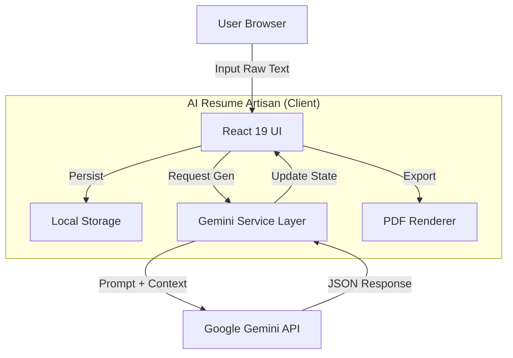

# System Architecture

## 1. High-Level Design
AI Resume Artisan operates as a **Fat Client / Thin Server** architecture. The "Server" is effectively just the Google Gemini API. The client handles all state, rendering, and orchestration.

## 2. Key Components

### A. The Orchestrator (`App.tsx`)
*   Manages the global state (Resume Data, UI State).
*   Coordinates between the Input Panel and the Preview Panel.

### B. The Intelligence Layer (`geminiService.ts`)
*   Abstracts API complexity.
*   Handles prompt engineering strategy (System Instructions, JSON Schemas).
*   Manages "Thinking Budget" configurations for `gemini-3-pro`.

### C. The Visual Engine (`ResumePreview.tsx`)
*   Pure functional component.
*   Renders data based on selected `Template` and `Settings`.
*   Uses CSS Grid and Flexbox to enforce A4 constraints.

## 3. Data Flow
1.  **Input:** User types in `ResumeInput`.
2.  **Trigger:** `generateResumeFromText` is called.
3.  **Processing:** Gemini API returns structured JSON.
4.  **Parsing:** `parseJsonFromText` sanitizes the output (handles Markdown code fences).
5.  **State Update:** React state updates, triggering a re-render of `ResumePreview`.
6.  **Persistence:** `useEffect` hook syncs state to `localStorage`.

## 4. Security Model
*   **API Key:** Injected via build-time environment variable.
*   **Data:** Strictly local. Clearing browser cache wipes data (feature, not bug).
